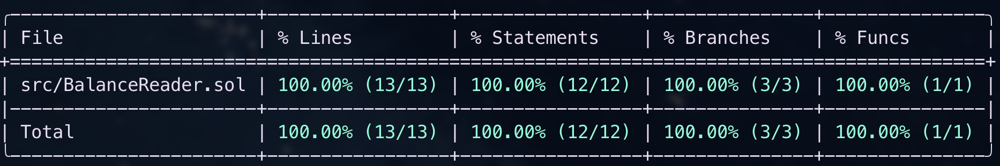

# 📘 BalanceReader.sol

### Purpose
`BalanceReader.sol` is a lightweight, read-only helper contract used in **Challenge 1 — Portfolio Indexer**.  
It aggregates multiple ERC-20 `balanceOf` calls into a single RPC, reducing network overhead and improving portfolio indexing performance.

---

## 📦 State Variables
This contract is intentionally **stateless**: it does not define or persist any storage variables.

- No mappings  
- No counters  
- No configuration

This makes it gas-efficient and safe for repeated read calls.

---

## ❌ Custom Errors
This contract does not define any custom errors.

It uses Solidity’s `try/catch` around external calls to tolerate failures gracefully:

- If a token reverts on `balanceOf`, the contract catches the error and returns `0` for that token.

---

## ⚙️ Functions

### `batchBalanceOf`
```solidity
function batchBalanceOf(address owner, address[] calldata tokens)
    external
    view
    returns (uint256[] memory balances);
```
#### Parameters
- **`owner`** — The address whose balances will be queried.  
- **`tokens`** — Array of ERC-20 token contract addresses.

---

#### Returns
- **`balances`** — Array of token balances aligned by index with `tokens`.

---

#### Internal Logic
- Iterates through the `tokens` array.  
- Calls `balanceOf(owner)` on each token.  
- Wraps each call in `try/catch`.  
- On failure, pushes `0` instead of reverting the entire call.

---

#### Rationale
- Avoids N per-token RPCs in frontend apps.  
- Provides a single read endpoint for portfolio dashboards (used as **Approach 3** in Challenge 1).

---

## 📡 Events
This contract does **not** emit events.  
It is purely a **view helper**.

---

## 🚀 Deployment Details
- **Networks:** Ethereum Mainnet, Arbitrum  
- **Address (deterministic via CREATE2):**
```js
0xED259223F06eC265A80376251E483657572c10BD
```
- **Frontend configuration (.env):**
```js
NEXT_PUBLIC_C1_ADDRESS=0xED259223F06eC265A80376251E483657572c10BD
```

---

## 🔗 Integration Notes

### viem (TypeScript)
```ts
import { BalanceReaderAbi } from "./abi";

const balances = await publicClient.readContract({
address: process.env.NEXT_PUBLIC_C1_ADDRESS!,
abi: BalanceReaderAbi,
functionName: "batchBalanceOf",
args: [ownerAddress, tokenAddresses],
});
```
- Returned balances are **raw integers** (`uint256`).  
- Must be formatted using the correct token decimals (from discovery or on-chain `decimals()`).

## 🔒 Safety & Gas Considerations
- **Stateless** — the contract performs no writes, only reads.  
- **Graceful failures** — `try/catch` ensures non-standard ERC-20s don’t break the entire batch; instead, balances default to `0`.  
- **Gas profile** — execution cost grows linearly with the number of tokens queried but is still significantly cheaper and more efficient than issuing many separate RPC round trips from the frontend.  
- **Reliability** — safe to integrate in both frontend dashboards and middleware indexers because it never reverts due to a single bad token.  

---

## 🧪 Testing
The Foundry test suite covers:

- Valid ERC-20 tokens returning correct balances.  
- Non-standard or reverting tokens safely returning `0`.  
- Empty input arrays handled gracefully.  
- Gas measurement comparisons across different batch sizes.

### Coverage Report


*(Generate via `forge coverage`; save screenshot at `solidity/challenge-1/docs/coverage.png`.)*

---

## 📂 File Location

```
solidity/challenge-1/src/BalanceReader.sol
solidity/challenge-1/test/BalanceReader.t.sol
solidity/challenge-1/srcipt/BalanceReader.s.sol
solidity/challenge-1/docs/coverage.png
```

---

## ✅ Status
- Finalized and deployed.  
- Production-ready.  
- Used in Challenge 1 frontend as **Approach 3: Smart Contract Batch**.