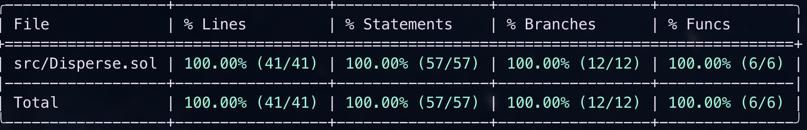

# 📘 Disperse.sol

### Purpose
`Disperse.sol` is the batch transfer contract used in **Challenge 2 — Multi-Send Tool**.  
It enables sending ETH or ERC-20 tokens to multiple recipients in a **single transaction**, reducing the number of approvals and improving gas efficiency when many recipients are involved.

---

## 📦 State Variables
- The contract is intentionally **stateless**.  
- It does not hold persistent storage except for minimal reentrancy protection if applied.  
- No mappings, counters, or configuration parameters.

---

## ❌ Custom Errors
The contract defines explicit errors for clear revert reasons:

- `error EthSendFailed();` — thrown if an ETH transfer fails.  
- `error TransferFromFailed();` — thrown if an ERC-20 `transferFrom` call fails.  
- `error TransferFailed();` — thrown if an ERC-20 `transfer` call fails.  
- `error InvalidInput();` — thrown if arrays are empty, mismatched, or contain invalid data.  

---

## ⚙️ Functions

### ETH Path

#### `disperseEther`
```solidity
function disperseEther(address[] calldata recipients, uint256[] calldata values) 
    external 
    payable
```
#### Parameters
- **`recipients`** — Array of addresses to receive ETH.  
- **`values`** — Array of amounts in wei to send to each recipient.  

---

#### Logic
- Requires `msg.value >= sum(values)`.  
- Iterates through `recipients` and sends ETH using low-level `call`.  
- Refunds any unused ETH back to `msg.sender`.  
- Reverts if any transfer fails.  

---

### `disperseToken`
```solidity
function disperseToken(address token, address[] calldata recipients, uint256[] calldata values) 
    external
```
#### Parameters
- **`token`** — ERC-20 contract address.  
- **`recipients`** — Array of addresses to receive tokens.  
- **`values`** — Array of token amounts (in smallest unit) to send to each recipient.  

---

#### Logic
- Requires sender to `approve` the full amount in advance.  
- Pulls total once via `transferFrom(sender, this, total)`.  
- Iterates through `recipients` and transfers tokens via `transfer`.  
- Reverts if any transfer fails.
- Rejects fee-on-transfer tokens (strict accounting ensures totals must match).

---

## 📡 Events
- **`TransferOut(address indexed token, address indexed to, uint256 amount)`**  
  Emitted for each recipient transfer (ETH or ERC-20).  

- **`BatchSent(address indexed token, address indexed sender, uint256 total, uint256 count)`**  
  Emitted once per batch, summarizing total amount and recipient count.  

---

## 🚀 Deployment Details
- **Networks:** Ethereum Mainnet, Arbitrum  
- **Address (deterministic via CREATE2):**
```js
0x45Eb2dF3c12C8fF7977bAF3f153E92C6a4933e69
```
- **Frontend configuration (.env):**
```js
NEXT_PUBLIC_C2_ADDRESS=0x45Eb2dF3c12C8fF7977bAF3f153E92C6a4933e69
```

## 🔗 Integration Notes

### ETH Batch Send
```ts
await publicClient.writeContract({
  address: process.env.NEXT_PUBLIC_C2_ADDRESS!,
  abi: DisperseAbi,
  functionName: "disperseEther",
  args: [recipients, values],
  value: totalEth,
});
```

### ETH Batch Send
```ts
// 1. Approve total token amount to contract
await erc20Contract.approve(NEXT_PUBLIC_C2_ADDRESS, total);

// 2. Call disperseToken
await publicClient.writeContract({
  address: process.env.NEXT_PUBLIC_C2_ADDRESS!,
  abi: DisperseAbi,
  functionName: "disperseToken",
  args: [tokenAddress, recipients, values],
});
```
- Always validate that `recipients.length == values.length`.
- Allowance must cover the total token amount.

---

## 🔒 Safety & Gas Considerations
- **Atomicity** — all transfers succeed or the entire transaction reverts.  
- **Refunds** — leftover ETH is always returned to the sender.  
- **Validation** — disallows empty arrays, mismatched lengths, zero addresses, or zero amounts.  
- **Unsupported tokens** — fee-on-transfer ERC-20s are explicitly not supported to avoid mismatched accounting.  
- **Reentrancy** — no persistent state; risk is minimized and external calls are bounded inside loops.  

---

## 💲 Pricing & Gas Handling

### ETH Transfers
- Batch becomes cheaper only when sending to many recipients.  
- **Break-even point:** Batch is cheaper at **6 or more recipients**.  

| Recipients | Batch Gas | Individual Gas | Cheaper     |
|------------|-----------|----------------|-------------|
| 1          | 67,106    | 24,538         | Individual  |
| 2          | 81,392    | 48,976         | Individual  |
| 6          | 138,536   | 147,228        | Batch       |

---

### ERC-20 Transfers
- Higher fixed cost (approval + single `transferFrom`).  
- **Break-even point:** Batch is cheaper at **4 or more recipients**.  

| Recipients | Batch Gas | Individual Gas | Cheaper     |
|------------|-----------|----------------|-------------|
| 1          | 122,980   | 44,382         | Individual  |
| 2          | 132,385   | 88,764         | Individual  |
| 4          | 151,195   | 177,528        | Batch       |

---

### Performance Notes
- **ETH** — batching is only efficient when sending to ≥6 recipients. For small groups, individual transfers are cheaper.  
- **ERC-20** — batching becomes efficient earlier, starting from ≥4 recipients.  
- **General rule** — batch is not always optimal; efficiency depends on the number of recipients.  

---

## 🧪 Testing
The Foundry test suite covers:

- ETH batch send (success + refund logic).  
- ERC-20 batch send (approval + transfer).  
- Reject cases:  
  - Empty arrays  
  - Mismatched array lengths  
  - Zero address recipient  
  - Zero amount  
  - Insufficient allowance  
  - Fee-on-transfer tokens  
- Reentrancy simulation with malicious tokens.  
- **Fuzz testing** on recipient arrays and amounts to ensure consistent behavior across edge cases.    

### Coverage Report
  

*(Generated via `forge coverage`; saved at `solidity/challenge-2/docs/coverage.png`.)*

---

## 📂 File Location

```
solidity/challenge-2/src/Disperse.sol
solidity/challenge-2/test/Disperse.t.sol
solidity/challenge-2/srcipt/Disperse.s.sol
solidity/challenge-2/docs/coverage.png
```

---

## ✅ Status
- Finalized and deployed.  
- Production-ready.  
- Integrated in Challenge 2 frontend for batch ETH and ERC-20 transfers.
