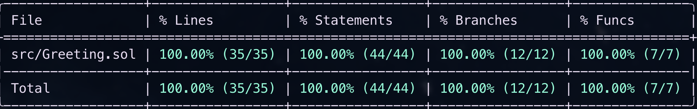

# 📘 Greeting.sol

### Purpose
`Greeting.sol` powers **Challenge 4 — Greeting Wall**.  
It records greetings in a **gas-efficient** way by storing only the **hash** of the message on-chain while emitting the **full message** in an event.  
Users can post greetings **free**, with **ETH**, or with **ERC-20** via **EIP-2612 permit** or **Permit2 signatureTransfer**.

---

## ❌ Custom Errors

```solidity
// Thrown when a required address parameter is the zero address (e.g., feeReceiver, token).
error ZeroAddress(string param);

// Thrown when the provided ETH or ERC-20 fee amount is zero or otherwise invalid for a premium path.
error InvalidFee(uint256 fee);

// Thrown when an ERC-20 pull fails (non-standard return, insufficient allowance/balance, or revert during transferFrom).
error PullFailed(address token, address from, address to, uint256 amount);

// Thrown when the token specified in a permit payload does not match the expected token for this call.
error WrongPermitToken(address expected, address actual);

// Thrown if the Permit2 contract/dependency is not configured but a Permit2 path is attempted.
error Permit2NotConfigured();

// Thrown when sending ETH via low-level call fails (recipient reverts or out-of-gas).
error EthTransferFailed(address to, uint256 amount);

// Thrown when forwarding ETH or ERC-20 tokens to the FEE_RECEIVER fails unexpectedly.
error ForwardFailed();
```

---

## 📡 Event

### `GreetingLogged`
- **Purpose:** Emits the *full* greeting text for off-chain indexing while keeping on-chain storage minimal.
- **Fields:**
  - `user` *(indexed)* — Sender who posted the greeting.
  - `fullMessage` — Complete greeting string (UTF-8).
  - `messageHash` — `keccak256(fullMessage)`, used by the frontend to verify integrity.
  - `premium` — `true` if a payment occurred (ETH or ERC-20); `false` for free posts.
  - `fee` — Amount of payment: `msg.value` for ETH or token amount for ERC-20.
  - `token` *(indexed)* — `address(0)` for ETH; token address for ERC-20.

**Notes**
- Only the **hash** is retained in storage; the **string** lives in the event (saves storage gas).
- Indexing `user` and `token` enables efficient filtering in indexers/subgraphs.

---

## 🧠 State Variables & Mapping

- `bytes32 lastGreetingHash`
  - Stores **only the hash** of the most recent greeting to minimize storage costs.
- `uint256 totalCounter`
  - Global counter for total greetings ever posted (across all users).
- `mapping(address => uint256) userGreetingCounter`
  - Per-user counter for number of greetings posted.
- `address immutable FEE_RECEIVER`
  - Destination for premium payments (ETH and ERC-20). Set once in the constructor.
- `IPermit2 immutable PERMIT2`
  - Permit2 contract reference. If set to `address(0)`, the **Permit2 path is disabled** and calls to it will revert.

**Design Intent**
- Minimal storage: counters + last hash only.
- Payments are forwarded **immediately** to `FEE_RECEIVER` to avoid retained balances.

---

## 🏗 Constructor

**Signature (semantic description):**
- Inputs: `_feeReceiver`, `permit2`.

**Behavior**
- Validates `_feeReceiver != 0x0`, otherwise reverts with `ZeroAddress("FEE_RECEIVER")`.
- Sets:
  - `FEE_RECEIVER = _feeReceiver` (immutable).
  - `PERMIT2 = IPermit2(permit2)` (immutable; `address(0)` means Permit2 is disabled).
- **Recommendation:** Use an EOA or a non-reentrant contract for `FEE_RECEIVER` to avoid bounce loops.

---

## 🚪 External Functions

### 1) `setGreetingETH` — Free & ETH Path
**Inputs:**
- `newGreeting` — Full greeting text.

**Behavior**
- Calls internal `_updateGreeting` with:
  - `isPremium = (msg.value > 0)`
  - `fee = msg.value`
  - `token = address(0)`
- If `msg.value > 0`, forwards ETH to `FEE_RECEIVER` via low-level `call`.
  - Reverts with `EthTransferFailed(FEE_RECEIVER, msg.value)` if the transfer fails.

**Side Effects**
- Updates `lastGreetingHash`, `totalCounter`, and `userGreetingCounter[msg.sender]`.
- Emits `GreetingLogged` with ETH semantics (token = `address(0)`).

**Error Conditions**
- `EthTransferFailed(...)` if forwarding fails.

---

### 2) `setGreetingWithPermit2612` — ERC-20 with EIP-2612 Permit
**Inputs:**
- `token` — ERC-20 supporting `permit(...)`.
- `fee` — Token amount to pull.
- `deadline` — Permit deadline.
- `v,r,s` — EIP-712 signature.
- `newGreeting` — Full greeting text.

**Behavior**
- Validates:
  - `token != 0x0` or reverts `ZeroAddress("token")`.
  - `fee > 0` or reverts `InvalidFee(fee)`.
- Calls `permit(msg.sender, address(this), fee, deadline, v, r, s)` on the token.
- Executes `transferFrom(msg.sender, FEE_RECEIVER, fee)`.
  - Reverts `PullFailed(token, msg.sender, FEE_RECEIVER, fee)` on failure.
- Calls `_updateGreeting(msg.sender, newGreeting, true, fee, token)`.

**Side Effects**
- Updates counters + last hash.
- Emits `GreetingLogged` with token semantics.

**Error Conditions**
- `ZeroAddress("token")`, `InvalidFee(fee)`, `PullFailed(...)`.
- If your code validates token identity against signed payload, `WrongPermitToken(expected, actual)` may be used (per your design).

---

### 3) `setGreetingWithPermit2` — ERC-20 with Permit2 signatureTransfer
**Inputs:**
- `token` — ERC-20 token address.
- `fee` — Token amount authorized.
- `permit` — Permit2 `PermitTransferFrom` struct (includes token + amount + nonce + deadline).
- `signature` — Signed Permit2 payload.
- `newGreeting` — Full greeting text.

**Behavior**
- Validates:
  - `PERMIT2 != 0x0` or reverts `Permit2NotConfigured()`.
  - `token != 0x0` or reverts `ZeroAddress("token")`.
  - `fee > 0` or reverts `InvalidFee(fee)`.
  - `permit.permitted.token == token` or reverts `WrongPermitToken(token, permit.permitted.token)`.
- Calls `permitTransferFrom(permit, {to: FEE_RECEIVER, requestedAmount: fee}, msg.sender, signature)` on Permit2.
- Calls `_updateGreeting(msg.sender, newGreeting, true, fee, token)`.

**Side Effects**
- Updates counters + last hash.
- Emits `GreetingLogged` with token semantics.

**Error Conditions**
- `Permit2NotConfigured()`, `ZeroAddress("token")`, `InvalidFee(fee)`, `WrongPermitToken(...)`.
- `PullFailed(...)` equivalent is enforced via Permit2; if transfer fails, the call reverts.

---

## 🧩 Internal Function

### `_updateGreeting`
**Inputs:**
- `user`, `newGreeting`, `isPremium`, `fee`, `token`.

**Behavior**
- Computes `hash = keccak256(bytes(newGreeting))`.
- Updates state:
  - `lastGreetingHash = hash`
  - `totalCounter += 1` (unchecked)
  - `userGreetingCounter[user] += 1` (unchecked)
- Emits:
  - `GreetingLogged(user, newGreeting, hash, isPremium, fee, token)`

**Notes**
- This function centralizes:
  - The hashing logic.
  - Counter increments.
  - Event emission.

---

## 📥 `receive` and `fallback`

### `receive() external payable`
- Any direct ETH sent to the contract is **immediately forwarded** to `FEE_RECEIVER` via low-level `call`.
- Reverts with `ForwardFailed()` if forwarding fails.
- **Design Goal:** The contract should not retain ETH (no idle balances).

### `fallback() external payable`
- Same behavior as `receive`: forwards any ETH to `FEE_RECEIVER` and reverts on failure with `ForwardFailed()`.

**Notes**
- Having both ensures **any** ETH transfer path (direct send, unknown calldata) forwards ETH.
- This reduces reentrancy surface and avoids trapped funds.

---

## 🔒 Invariants & Safety Considerations

- **No retained balances:** All premium ETH is forwarded; ERC-20 is sent directly to `FEE_RECEIVER`.
- **Minimal storage:** Only `lastGreetingHash` + counters are stored.
- **Permit correctness:** EIP-2612 and Permit2 are validated before transferring tokens; wrong tokens or invalid signatures revert.
- **Robust reverts:** Custom errors (`ZeroAddress`, `InvalidFee`, `WrongPermitToken`, `Permit2NotConfigured`, `PullFailed`, `EthTransferFailed`, `ForwardFailed`) provide precise failure reasons.
- **Event integrity:** Off-chain consumers can verify `keccak256(fullMessage) == messageHash`.

---

## 🧪 Testing

The Foundry test suite for `Greeting.sol` is comprehensive and covers **ETH**, **EIP-2612**, and **Permit2** paths, including fuzz testing and negative scenarios.  

### ETH Path
- ✅ **No-fee greeting** — updates hash and counters without transferring ETH.  
- ✅ **With-fee greeting** — forwards ETH to `FEE_RECEIVER` and emits correct event.  
- ✅ **Fallback & receive** — forwards ETH both with and without calldata.  
- ✅ **Reverts** when the fee receiver contract rejects ETH (`EthTransferFailed` / `ForwardFailed`).  

### EIP-2612 Path
- ✅ **Valid permit** — allowance set, tokens pulled, greeting logged.  
- ✅ **Reverts** on:  
  - Zero token address (`ZeroAddress("token")`).  
  - Zero fee (`InvalidFee(0)`).  
  - Token transfer failure (`PullFailed`).  
  - Invalid signature (`INVALID_SIG`).  
  - Invalid domain (`INVALID_DOMAIN`).  
  - Wrong owner (`WRONG_OWNER`).  
  - Expired permit (`EXPIRED`).  
- ✅ **Fuzz tests** for greetings with random text and fees.  
- ✅ **Fuzz invalid signature** — ensures no state changes occur when signature is invalid.  

### Permit2 Path
- ✅ **Valid Permit2 transfer** — succeeds when properly approved, tokens forwarded to `FEE_RECEIVER`.  
- ✅ **Reverts** on:  
  - Permit2 not configured (`Permit2NotConfigured`).  
  - Wrong token (`WrongPermitToken`).  
  - Zero token (`ZeroAddress("token")`).  
  - Zero fee (`InvalidFee(0)`).  
  - Invalid signature (`INVALID_SIG`).  
  - Invalid domain (`INVALID_DOMAIN`).  
  - Wrong owner (`WRONG_OWNER`).  
  - Expired permit (`EXPIRED`).  
- ✅ **Fuzz tests** for greetings with random text and fees.  
- ✅ **Fuzz invalid signature** — ensures no state changes occur when signature is invalid.  

### Fuzz Testing
- Randomized greetings (arbitrary strings, including unicode).  
- Randomized ETH amounts (bounded) and token fees (bounded).  
- Randomized invalid signature values `(v,r,s)` for both EIP-2612 and Permit2.  

### Invariants Verified
- `lastGreetingHash` always matches `keccak256(fullMessage)` of the last successful greeting.  
- `totalCounter` increments only on successful greetings.  
- `userGreetingCounter[user]` increments only for the actual sender.  
- No funds are trapped in the contract (all ETH forwarded; all ERC-20s delivered to `FEE_RECEIVER`).  
- Invalid signatures, expired permits, and wrong-domain cases **revert and cause no state changes**.  

### Coverage Report
  

*(Generated via `forge coverage`; saved at `solidity/challenge-2/docs/coverage.png`.)*

---

## 🚀 Deployment Details
- **Networks:** Ethereum Mainnet, Arbitrum  
- **Address (deterministic via CREATE2):**
```js
0xF7367642f4bC701b3b44144399c0CB0D7470296F
```
- **Frontend configuration (.env):**
```js
NEXT_PUBLIC_C4_ADDRESS=0xF7367642f4bC701b3b44144399c0CB0D7470296F
```

---

## 📂 File Location

```
solidity/challenge-4/src/Greeting.sol
solidity/challenge-4/test/Greeting.t.sol
solidity/challenge-4/srcipt/Greeting.s.sol
solidity/challenge-4/docs/coverage.png
```

---

## ✅ Status
- Finalized and deployed.  
- Production-ready.  
- Integrated in Challenge 4 frontend for Greeting Wall.
